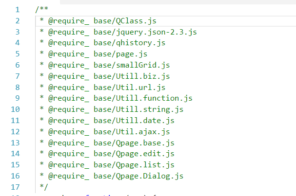
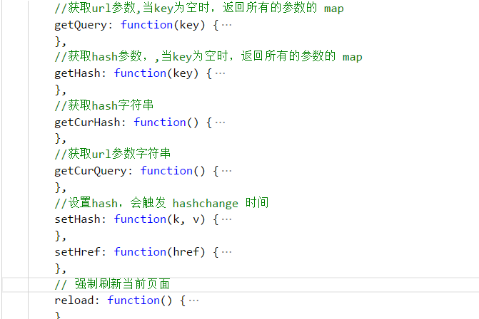
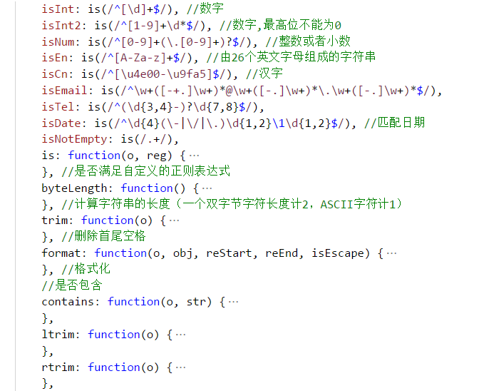
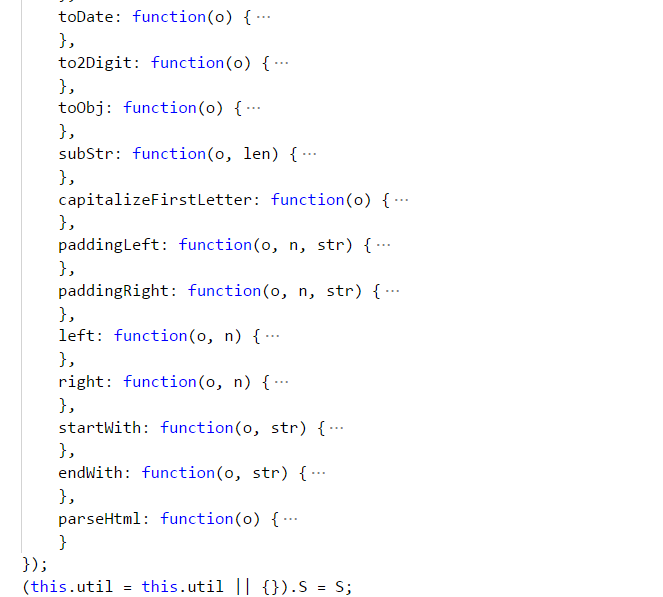
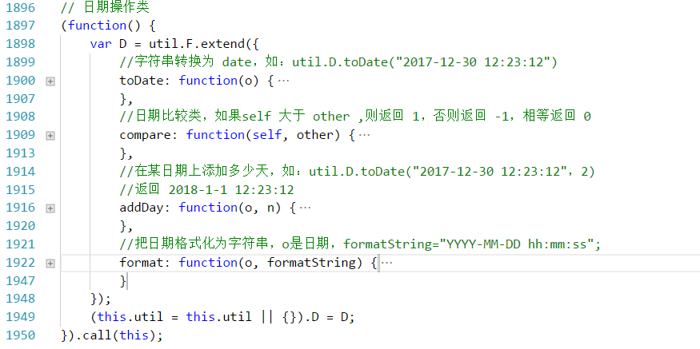

# QPage 主要包括以下工具类


## QClass
> 
>     这个是 JavaScript 的 class 的实现，可以继承，可以定义静态方法，可以mixin，有可以在子类的方法中调用父类的方法。
 定义一个class的用法是：
>        
       Class.define("class1", {
            extend: 父类, //继承某类
            mixins:[], //mixins某类，类似于 trait
            initialize:function(){},//构造函数
            fun1: function (e, el) {
            },
            fun2: function (e, el) {
            }
        });
实例化类的用法是：
>      
    var instance= new class1();
    instance.fun1();

## jquery.json
> 
>     javascript 的 JSON类库，用法同原生的JSON，不解释

## qhistory
只有当 a 标签上有 qhistory 这个属性时，点击 a 链接，才会保存页面的状态
html页面中可以这么使用
``` html
 <a href="testtopb.html" qhistory="goto">去往 b 页面</a>
 <a  qhistory="goback">返回到 a 页面</a>
 程序会自动为 带有属性 qhistory 的元素绑定事件
```
js中可以这么调用
``` javascript
//保存当前页面状态，去往其他页面
 Qhistory.goto("testtopb.html"); 
 //后退
 Qhistory.goback();
```


## page
> 
>     分页组件，配合grid使用的


## smallgrid
> 
>     grid组件，用法如下：
``` javascript
 var _smallGrid = new smallGrid([
          {header:"表头",html:"内容{name}"},
          {header:"年龄",html:"{info.age}"}, 
          {header:"表头",render:function((el, data, rowIndex, col, cellIndex){
              // el 是当前的单元格，内容长的话，会自动换行
              //data 是当前行数据
              // rowIndex 是当前行是第几行
              // col 是当前单元格，这个不会自动换行
              // cellIndex 当前单元格是第几个单元格
             el.html("这是内容");
          }},
      ], [
          {id:1,name:"ssf",info:{age:23}},
      ]);
    $("body").append( _smallGrid.table);
```

## util.biz
> 
>     后台一般是内嵌 iframe ，这个是用来动态调整 iframe 高度的

## util.url
> 
>     工具类，包含了 url 地址的各种操作，


## util.function
> 
>     高阶函数的实现，一般用不到

## util.String
> 
>     字符串工具类操作类，用法示例如下：
``` javascript
    util.S.isInt("23")  // 返回true
    util.S.isInt("a23")  // 返回false
    util.S.format("a:{aa},b:{b.bb}",{
        aa:"thisa",
        b:{
            bb:"thisbb"
        }
    }) //返回  a:thisa,b:thisbb
```



## util.Date
> 
>     日期工具类操作类，用法示例如下：


## util.ajax
> 
>     对jquery 的ajax做了一层封装：用法同jquery的ajax相同，具体封装如下：  
>     1.防重复提交，防止用户多次点击按钮，能自动给点击的按钮添加loading效果
>     2.添加了上传文件的功能，兼容到ie7
>     3、针对 Qpage做了一些定制化的默认参数

## util.wrap
> 
>     对json的操作的封装。
>     当我们要访问一个比较深的json的数据时，需要层层判断json的key是否存在，比较繁琐，
>     有了这个工具类，一切都简单了，具体用法如下：
``` javascript
    var obj={
            a:{
                a1:"ddd"
            },
            b:"ddd"
        };
    //常规的获取obj.a.a1的方法是
    console.info(obj.a.a1) 
    //如果我们获取一个不存在的属性，如获取 obj.c.cc，那么用常规方法就会报错
    console.info(obj.c.cc)
    //正确的做法是，
    obj=util.wrap(obj);
    //此时，我们访问以下方法获取 c.cc 这个属性，就不会报错了，只是返回null
    obj("c.cc") 
    //当然，即便用了util.wrap 包装了boj，还是可以用常规方法来获取属性，如
    console.info(obj.a.a1)  // 这个也还是可以使用的
```