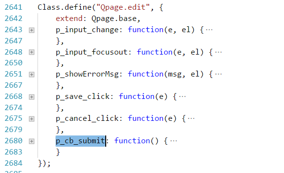
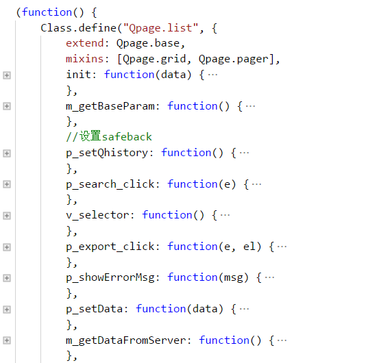
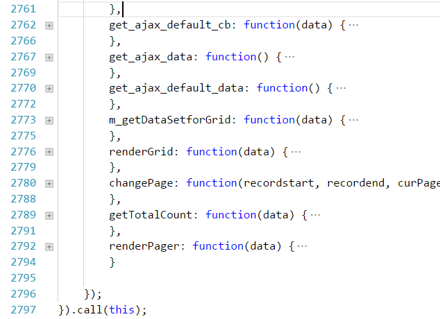

## Qpage.base
> - 最基础的类库，使用Class.define 方法定义的类
> - 它定义了基本的流程以及基础的方法以及规范
> - 它的任何方法都可以在子类中被覆盖重写
> - 本类借鉴了模块化开发的思想，实例化此类时，需指定一个 root 的dom 元素，此实例化的类只会接管 root 节点内的dom元素。root默认为 body

### 使用方法：
``` javascript
    /*
     * 通过main方法来生成一个继承 Qbase.base 的匿名类，
     * 并实例化这个匿名类，执行 init 方法
     */
    Qpage.base.main({

    });
    /
     * 也可以通过定义一个继承自 Qbase.base 的类，再实例化这个类
     */
    var _class = new Class({
        extend:Qbase.base,
        p_add_click:function(){

        }
    });
    //rootEl 是一个 dom 节点，类似于 Vue 中的 el
    var instant=new _class(rootEl);
    instant.init(data);
```

### 基本流程或生命周期是：
>> - 实例化的时候会执行 `initialize` 方法，在这个方法中会初始化各种组件，比如 `日期` 、`多选`、`suggest`、等 jquery ui 或 bootstrap 组件；同时，也会初始化 `面包屑导航栏`；也会定义好事件调用机制
>> - 调用 `init(data)` 方法，在这个方法里，会初始化各个 `input`、`组件`、等元素的默认值。这些值从哪儿来呢？优先用调用此方法时传过来的数据；如果么有，则从页面保存的状态中取；如果还没，则从 url 参数中取；如果还没，则不初始化默认值

### 事件机制
> - 事件的命名规则为：`p_元素标志_事件类型(e,el)`
> - 元素标志是元素的 `name`、`id`、`action` 等属性的值的任意一种，也可以通过覆盖 `v_selector` 自定义复杂的选择器
> - 事件类型有：`click` `focusin` `focusou`t `mouseenter` `mouseleave` `change` `keyup` `keydown` 等 jquery支持的事件，也可以通过覆盖 `v_eventBindType` 方法，使其支持其他jquery支持的事件
> - 事件机制是使用jquery的 `live` 机制实现的，所以，不管dom元素是实例化时就有的，还是通过js动态生成的，都可以用这种方法定义事件
> - 参数 `e` 代表 jquery 事件中的 `e` ，`el` 代触发此事件的 dom 元素，即 `e.target`
示例如下：
``` javascript
   Qpage.base.main({
     p_upate_click:function(e,el){
         e.preventDefault();
         e.stopPropagation();
         console.info([e,el]);
     }
   });
```

### 一些重要的方法
#### _p_setData(data)_
`init` 方法就是通过这个方法给各个dom元素或组件赋值的，此方法采用了mvp的设计思路，可以一次性给所有的元素赋值，只要元素的 `name` 或 `id` 的值与 `data` 中的key的值能对应上即可。
 赋值的同时，也会触发dom元素的 change 事件，从而触发它们的联动事件

####  _p_getData()_
 获取 `root` 内所有的 `input` 元素的值，如果需要对某些dom元素的做一些特殊的处理，可以覆盖此方法，示例如下：
``` javascript
   Qpage.base.main({
     p_getData:function(){
         // 可以通过 this.parent()  调用父类的  p_getData 方法
         var data=this.parent();
         //todo  对 data 做一些特殊处理
         return data;
     }
   });
```

####  _p_validate(el)_
验证 `root` 内 `input` 的值是否符合规则
当某 `input` 的值发生改变时，会触发此方法，但只验证当前 `input` 的值是否符合规则
当需要提交到服务端时，如点击 `保存` 按钮，会触发此方法，此时，会验证 `root` 内所有 `input` 的值是否符合规则

####  _p_getValidateRule()_
返回各个dom元素的值的验证规则
``` javascript
   Qpage.base.main({
     p_getValidateRule:function(){
         return {
             //某个元素可能需要多个验证规则，所以这个地方是数组
            mobile:[{
                reg:/^\d{11}$/, //正则
                msg:"手机号不正确"
            }],
            pwd:[{
                reg:/^.{6,20}$/, //正则
                msg:"密码格式不正确"
            }],
            confirm_pwd:[{
                reg:/^.{6,20}$/, //正则
                msg:"确认密码不能为空"
            },{
                //当某个验证规则很难用正则来表示时，可以用function来写验证逻辑
                // val 代表当前 input 元素的值
                // el 代表当前input 元素
                // data 代表root内所有 input 的值
                cb_reg:function(val,el,data){                    
                    return val===data.pwd;
                },
                 msg:"l两次输入的密码不一致"
            }],
         }
     }
   });
```
####  _ajax()_
参考 `工具类篇` 中的ajax，这里是直接通过 `mixin` 把那个 ajax 方法组合到这个类的

####  _this.find()_
当想用jquery的`$()`来筛选元素时候，强烈建议用 `this.find()` 代替 `$()`，参数与`$()` 的参数完全相同

## Qpage.edit
继承自 Qpage.base ，这个类是专门给 `编辑` 模块提供的，常规的 `编辑` 模块的功能流程如下：

> - 回显各个 `input` 的值，参考 `Qbase.base` 的 `init` 方法
> - 当某 `input` 的值发生改变时，验证此值是否符合规则，参考  `Qbase.base` 的 `_validate(el)`  `p_getValidateRule`
### 保存流程
> 通过 `p_getData` 方法获取 form 表单的值，
> 通过  `p_getValidateRule` 方法获取各个 dom 的验证规则
> 通过 `_validate(el)` 验证所有的 `input` 
> 如果没有通过验证，则调用 `p_showErrorMsg(errorMsg,el)` 显示错误信息
> 如果通过验证，则 通过 `ajax` 方法把数据提交 `form` 的 `action` 属性指定的 url 上
>> 如果服务的返回错误信息，则默认会调用 alert 提示错误信息
>> 如果服务的返回正确，则会调用 `p_cb_submit` 处理后续操作

这个类在 `Qbase.base` 的基础上，添加了以下方法

### 常规用法为：
``` javascript
    /*
     * 通过main方法来生成一个继承 Qbase.edit 的匿名类，
     * 并实例化这个匿名类，执行 init 方法
     */
    Qpage.edit.main({
        p_getValidateRule:function(){
            //返回各个input的验证规则
            return [...];
        },
        //如果默认的错误提示不能满足需求，则可以重写这个方法来实现自己的错误提示
        p_showErrorMsg: function(msg, el){
            //msg 是要提示的错误信息
            //el 发生错误的 dom 元素 
        },
        p_cb_submit: function() {
            // 提交成功返回后，这里写自己的逻辑，如返回上一页等等
            Qpage.Alert({ msg: "保存成功" });
        }
    });
```

## Qpage.list
继承自 Qpage.edit ，这个类是专门给 `列表页` 提供的，常规的 `列表页` 模块的功能流程如下：
> - 回显筛选条件，参考 `Qpage.base` 的 `init` 方法
> - 刚打开页面时，会通过调用 `p_search_click` 方法来获取服务的数据

### p_search_click 的实现流程如下：

``` mermaid
graph TD;
    search[搜索按钮]--p_search_click-->event[点击事件]
    event--p_getData-->data{获取搜索条件}
    data--p_validate-->check{验证搜索条件}
    check--成功-->server{提交到服务端}
    check--失败-->tips{提示错误信息}
    server--renderGrid-->grid[渲染列表]
    server--renderPager-->page[渲染分页]
```


### 常规用法为：
``` javascript
    /*
     * 通过main方法来生成一个继承 Qbase.list 的匿名类，
     * 并实例化这个匿名类，执行 init 方法
     */
    Qpage.list.main({
        getGridCols: function () {
            return [
                {header: "序号", html: '{rowIndex}'},
                {header: "用户ID", html: '{id}'},
                {header: "昵称", html: "{nickname}" ,style:{width:80}},
                {header: "头像", html: ""},
                {header: "星座", html: "{ext.xingzuo}"},
                {
                    header: "操作", render: function (el, data, rowIndex, col, cellIndex) {
                    var html = [' <a action="update" class="btn btn-primary btn-sm" style="line-height:0.3">编辑</a>'];
                    html.push('<a qhistory="goto" href="/article/edit?id=\' + data.id + \'" class="btn btn-xs btn-info">查看日志</a>');
                    el.html(html.join("  "));
                }
                }
            ];
        },
        p_update_click: function (e, el) {
            //todo
        },
        p_add_click: function (e, el) {
            //todo
        }
    });
```

## Qpage.Dialog
这是专门针对弹框做的类库，是在 `Qpage.edit` 的基础上，做了弹框的适配，弾层的规则是：
> 如果一屏能显示完整个弾层内容，则弾层定位方式为 `fixed`
> 如果一屏不能完整显示弾层的内容，则弾层定位方式为 `absolute`
> 当弾层内容变化引起弾层高度也发生变化时，可以调用 `this.resize()` 方法改变弾层的定位方式

> **当在 `iframe` 内部调用Dialog时，弾层会在父页面上弹出来，此时，用 `$` 筛选元素时可能会不好用，此时，务必使用 `this.find（）` 来代替 `$（）`**
### 常规用法
``` javascript
    /*
     * 通过main方法来生成一个继承 Qbase.Dialog 的匿名类，
     * 并实例化这个匿名类，执行 init 方法
     */
    Qpage.Dialog.main({
        init: function () {
            //给弾层中的input赋值
            this.parent(data);
        },
        //设置弾层的title
        v_getTitle: function () {
            return "修改启动广告图";
        },
        //设置弾层的的内容，返回 一段 html 字符串
        v_getContent: function () {
            return $("#dialog").html();
        },
        //设置弾层的按钮 返回 一段 html 字符串
        v_getButton: function () {
            return '<button class="btn btn-primary" id="save">保存</button> <button class="btn" id="close">取消</button> ';
        },
        // 同 Qpage.edit，这个是设置弾层中各个input 的验证规则
        p_getValidateRule: function () {
            var self = this;
            return {
                adnname: [{
                        reg: /^.+$/,
                        msg: "请输入名称"
                    }
                ],
                beginTime: [{
                        reg: /^.+$/,
                        msg: "请选择投放开始时间"
                    }
                ]
            };
        },
        //同 Qpage.edit，服务的返回成功后的回调方法
        p_cb_submit: function () {
            this.close();
            Qpage.Alert({
                msg: this.isEdit() ? "修改成功" : "添加成功",
                confirm: function () {
                    self.p_search_click();
                }
            });
        }
    });
```

## Qpage.Alert
基于 ` Qpage.Dialog` 定制的 `alert` ，用法如下
### 常规用法
``` javascript
    Qpage.Alert({
        msg: "要显示的内容",
        // 点击确定按钮会调用此方法
        confirm: function () {
            //todo
        }
    });
```

## Qpage.Confirm
基于 ` Qpage.Dialog` 定制的 `confirm` ，用法如下
### 常规用法
``` javascript
    Qpage.Confirm({
        msg: "要提示的内容",
        // 点击确定按钮会调用此方法
        confirm: function () {
            //todo
        },
        // 点击取消按钮会调用此方法
        cancel:function(){
            //todo
        }
    });
```